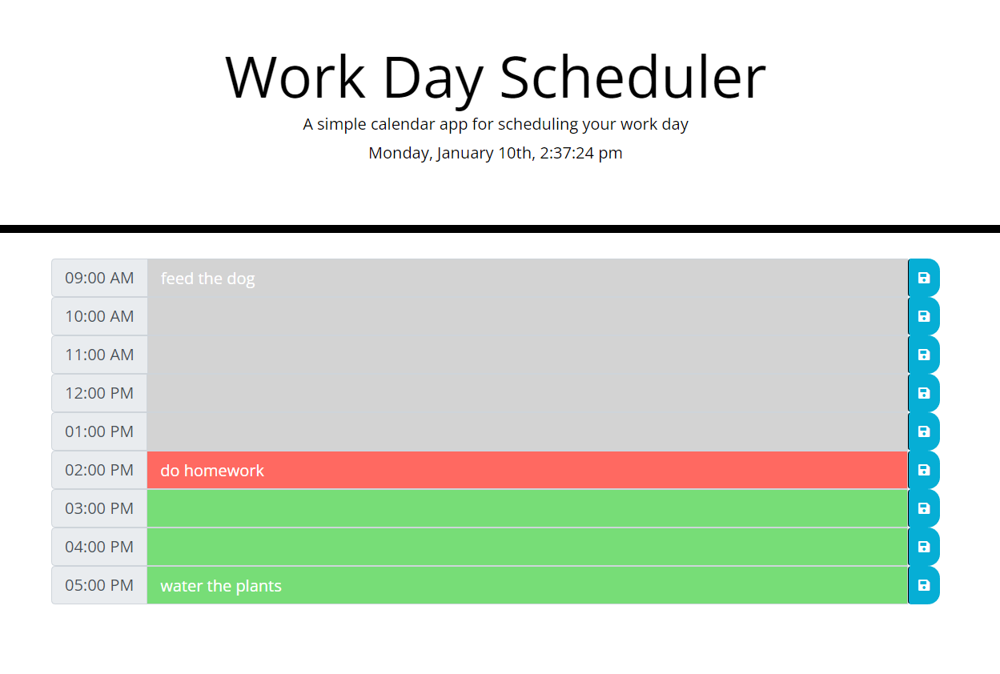

# Homework 5 - Day Planner

## Description

This program is created to aid the user in listing down daily activities to effectively manage their days. This simple daily calender allows a user to save events for each hour of the day from 9am to 5pm to local storage and can be accessed whenever needed. This program heavily relies on javascript, J Query, Moment.js and bootstrap to dynamically update the page with elements such as the current time, changing the colors to denote past, present or future and uses bootstrap for the calender itself.

This project is deployed to GitHub and can be accessed using the following links:
    -[GitHub Repository](https://github.com/cn-kp/homework5-day-scheduler),
    -[GitHub Deployed Link](https://cn-kp.github.io/Day-Planner/)

## Installation

To install this program all you need is a text editior. I would recommend Visual Studio Code. then download or clone the repository of the program

## Usage

The program is very simple to use and when loaded, the user will be presented with a listed calender, with hours listed on the left denoting each hour block as seen below

The user is required to input their hourly activities in the respective block and hit the save icon to commit the changes. This will save the users input into that block and can be access, when the page is reloaded. The color of the hour block also change depending on the current time to denote past, present or future for easy reference. 

## Credits

This homework project was quite challenging and I got stuck in some instances throughout the project.
Most notably was accessing and saving the user input into local storage and would like to thank my TA's for helping me come up with solutions.
